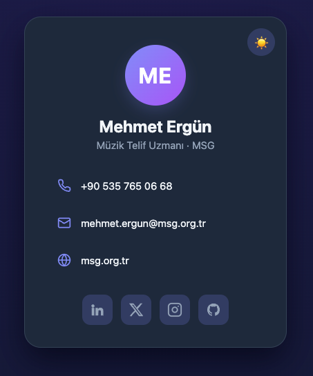

# BizCard

**Dijital kartvizit** oluşturma ve paylaşma uygulaması. Kullanıcılar kendi dijital
kartvizitlerini oluşturur, düzenler ve bir link ya da QR kod aracılığıyla
başkalarıyla paylaşabilir. Amaç, klasik basılı kartvizitin yerini alan,
güncellenebilir ve paylaşımı kolay bir dijital profil sunmaktır.

> Uygulama Next.js'te çalışıyor; kart formu Neon Postgres'e kayıt yapıyor.

🔗 Canlı: <https://bizcard-miuul-mu.vercel.app/>

## Ekran Görüntüsü

<p align="center">
  
</p>

## Özellikler (MVP)

- [ ] Kartvizit oluşturma ve düzenleme (şimdilik kod içinden: `lib/card-data.ts`)
- [x] Profil bilgileri: telefon, e-posta, web sitesi, sosyal medya linkleri
- [x] Paylaşım: link ve QR kod üretme
- [x] Kartvizit görüntüleme (herkese açık paylaşım sayfası)
- [x] Tema seçeneği (açık / koyu)
- [x] (Opsiyonel) Rehbere kaydet (vCard / `.vcf` indirme)
- [x] Form kayıtlarının veritabanına yazılması
- [ ] Kayıtları görüntüleyecek panel sayfası

## Teknoloji Yığını

- **Framework:** Next.js 16 (App Router) + TypeScript + React 19
- **QR kod:** `qrcode.react`
- **Veritabanı:** Neon Postgres (Vercel Marketplace) + Drizzle ORM; form
  kayıtları `leads` tablosuna bir Server Action ile yazılır
- **Veri saklama:** Tema tercihi için tarayıcı `localStorage`
- **Deployment:** Vercel

## Proje Yapısı

| Yol | Açıklama |
| --- | --- |
| `app/page.tsx` | Ana sayfa (kartvizit) |
| `app/privacy/page.tsx` | KVKK aydınlatma metni (`/privacy`) |
| `app/globals.css` | Tüm stiller (tema, düzen, responsive) |
| `components/` | `ProfilCard`, `Avatar`, `ContactList`, `SocialNav`, `ThemeToggle`, `QrCode`, `SaveContactButton`, `LeadForm` … |
| `app/actions/leads.ts` | Form Server Action'ı (doğrulama + veritabanı kaydı) |
| `lib/card-data.ts` | Kart içeriği (tek düzenlenebilir kaynak) |
| `lib/` | `config.ts` (DEPLOY_URL), `vcard.ts`, `theme.ts`, `date.ts` |
| `lib/db/` | Drizzle şeması (`leads`) ve `getDb()` |
| `docs/` | Tasarım ve plan dokümanları |

## Çalıştırma

```bash
npm install
vercel env pull .env.local --yes   # DATABASE_URL için
npm run dev                        # http://localhost:3000
npm run build                      # production build
```

Şemayı veritabanına uygulamak / kayıtlara bakmak:

```bash
npx dotenv -e .env.local -- npx drizzle-kit push
npx dotenv -e .env.local -- npx drizzle-kit studio
```

## Lisans

Bu proje için henüz bir lisans belirlenmemiştir.
